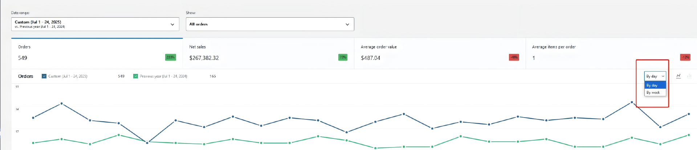
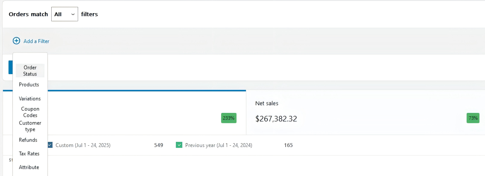

# 📊 International Sales Analytics Dashboard

> 一个功能强大的国际销售数据分析仪表板，提供实时数据监控和可视化分析

[](https://opensource.org/licenses/MIT)
[](https://developer.mozilla.org/en-US/docs/Web/JavaScript)
[](https://www.chartjs.org/)

## ✨ 特性

- 📈 **实时数据可视化** - 支持多种图表类型展示销售数据
- 🕐 **多时间维度分析** - 按小时、天、周、月进行数据统计
- 🔄 **时间段对比** - 支持不同时间段的数据对比分析
- 🎯 **流量来源分析** - 详细的访问来源和用户行为分析
- 📱 **响应式设计** - 完美适配桌面和移动设备
- 🎨 **现代化UI** - 采用玻璃拟态设计和渐变色彩

## 🚀 快速开始

### 在线预览

```bash
# 克隆项目
git clone https://github.com/yourusername/international-sales-analytics.git
cd international-sales-analytics

# 启动服务器
python start_server.py
```

访问 http://localhost:8080/assets/international.html 查看仪表板

### 页面版本

- **主版本**: `assets/international.html` - 完整功能的现代化界面
- **商务版**: `assets/international-business.html` - 专业商务风格
- **简化版**: `assets/index.html` - 轻量级版本

## 📸 界面预览

### 主仪表板
.png)

### 时间对比功能


### 多维度分析


## 🛠️ 技术栈

- **前端框架**: 原生JavaScript (ES6+)
- **图表库**: Chart.js 3.x
- **样式**: CSS3 + Tailwind CSS
- **数据处理**: 自定义DataProcessor类
- **服务器**: Python HTTP Server

## 📁 项目结构

```
international-sales-analytics/
├── 📂 src/                    # 源代码
│   ├── 📂 analysis/           # 数据分析脚本
│   ├── 📂 utils/              # 工具函数
│   └── 📂 visualization/      # 数据可视化
├── 📂 assets/                 # 静态资源
│   ├── 🌐 *.html             # 页面文件
│   ├── 🎨 *.css              # 样式文件
│   └── 🖼️ *.png              # 图片资源
├── 📂 data/                   # 数据文件
│   ├── 📂 raw/               # 原始数据
│   ├── 📂 processed/         # 处理后数据
│   └── 📂 external/          # 外部数据源
├── 📂 docs/                   # 项目文档
├── 📂 tests/                  # 测试文件
└── 📂 config/                 # 配置文件
```

## 🎯 核心功能

### 📊 数据可视化
- 销售趋势图表
- 订单量统计
- 流量来源分布
- 24小时访问趋势

### 📅 时间分析
- 自定义时间范围选择
- 多时间维度切换
- 同比环比分析
- 实时数据更新

### 🔍 深度分析
- 转化漏斗分析
- 用户行为热力图
- 地域分布统计
- 设备来源分析

## 🚀 部署方式

### 本地开发
```bash
# 方式一：Python脚本（推荐）
python start_server.py

# 方式二：批处理文件（Windows）
start_server.bat

# 方式三：手动启动
python -m http.server 8080
```

### 生产部署
```bash
# 使用Nginx
sudo cp -r . /var/www/html/analytics/

# 或使用Apache
sudo cp -r . /var/www/html/analytics/
```

## 📊 数据格式

支持JSON格式的数据输入，示例：

```json
{
  "date": "2025-08-31",
  "referer": "search_engine",
  "hour": 14,
  "request_times": 150,
  "unique_visitors": 120
}
```

## 🤝 贡献指南

1. Fork 本项目
2. 创建特性分支 (`git checkout -b feature/AmazingFeature`)
3. 提交更改 (`git commit -m 'Add some AmazingFeature'`)
4. 推送到分支 (`git push origin feature/AmazingFeature`)
5. 开启 Pull Request

## 📝 更新日志

### v1.0.0 (2025-08-31)
- ✨ 初始版本发布
- 📊 完整的数据可视化功能
- 🎨 现代化UI设计
- 📱 响应式布局支持

## 📄 许可证

本项目采用 MIT 许可证 - 查看 [LICENSE](LICENSE) 文件了解详情

## 👥 作者

- **lingrany** - *Initial work* - [lingrany](https://github.com/lingrany)

## 🙏 致谢

- [Chart.js](https://www.chartjs.org/) - 优秀的图表库
- [Tailwind CSS](https://tailwindcss.com/) - 实用的CSS框架
- 所有贡献者和用户的支持

---

⭐ 如果这个项目对你有帮助，请给它一个星标！

📧 有问题或建议？[提交Issue](https://github.com/lingrany/international-sales-analytics/issues)